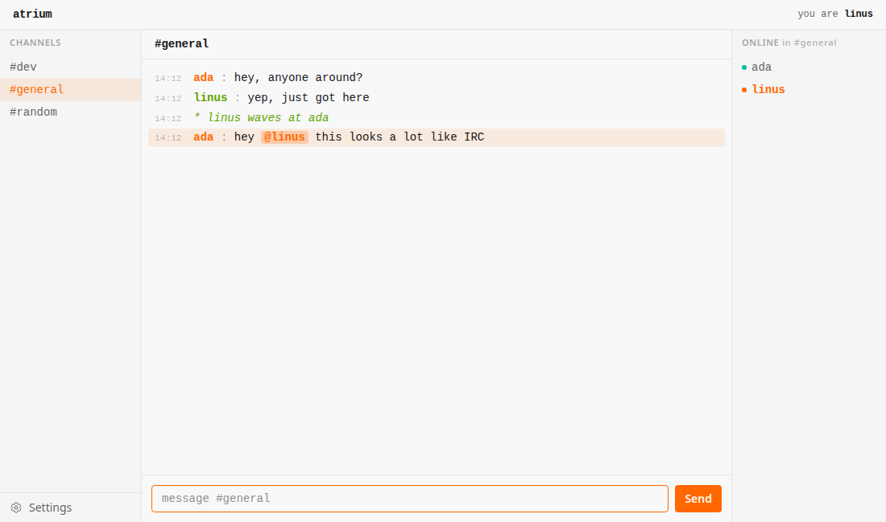
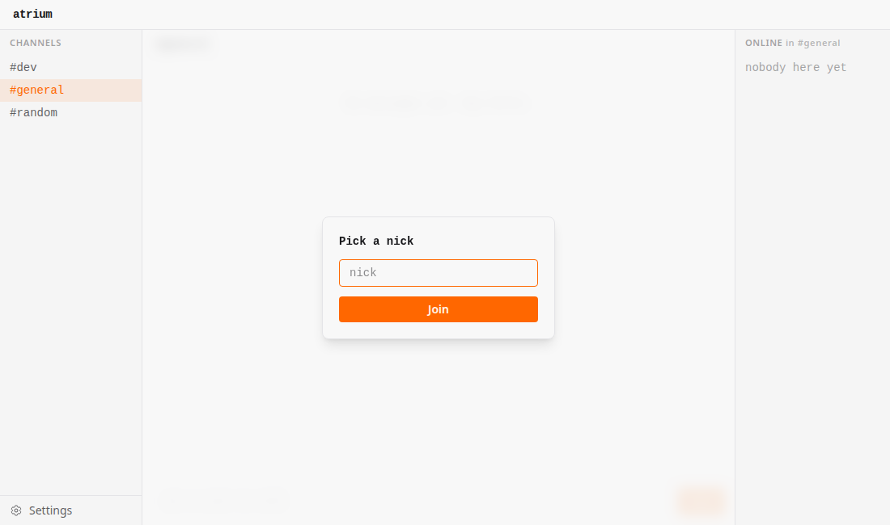

# atrium

A small chat server in the spirit of IRC: pick a nick, hop between channels in
the sidebar, talk. Built with Phoenix LiveView and backed by SQLite, so there is
no database server to run.



## Requirements

- Elixir 1.17+ and Erlang/OTP 26+

## Getting started

```sh
mix setup          # fetch deps, create the SQLite db, run migrations + seeds, build assets
mix phx.server     # http://localhost:4000
```

`mix setup` seeds three channels to start with: `#general`, `#random`, `#dev`.
The database lives in `atrium_dev.db` (gitignored); delete it to start fresh, or
run `mix ecto.reset`.

## Using it

Pick a nick on the splash prompt, then type in the composer at the bottom.



Anything starting with `/` is a command:

| Command | Effect |
| --- | --- |
| `/join #room` (or `/j`) | Switch to `#room`, creating it if it does not exist |
| `/nick name` (or `/n`) | Change your nick |
| `/me action` | Send an emote (`* name action`) |
| `/help` | List the commands |

New lines appear live for everyone in the channel. Opening a channel loads its
last 100 messages, and the on-screen log is capped at 100 lines as you chat.
Messages are limited to 2000 characters, nicks to 24 characters (letters,
numbers and a few IRC-safe symbols); channel names are lowercase, up to 32
characters.

## How it works

- **`Atrium.Chat`** — the context. Channels and messages are Ecto schemas in
  SQLite. `post_message/4` inserts a row and broadcasts it on a per-channel
  `Phoenix.PubSub` topic; a separate topic announces new channels so every
  client's sidebar stays current.
- **`AtriumWeb.ChatLive`** — the entire UI is one LiveView at `/`. It subscribes
  to the current channel, renders messages as a LiveView stream, and parses the
  slash commands.
- **Concurrency** — the SQLite connection uses WAL journal mode so reads never
  block the writer, plus a 5s `busy_timeout` so simultaneous writers wait for the
  lock instead of failing. Many people can talk at once without losing messages.

## Development

```sh
mix test           # unit + LiveView tests, including a concurrent-write test
mix precommit      # compile --warnings-as-errors, unused-deps check, format, test
```

## Deployment

Set `DATABASE_PATH` (where the SQLite file should live) and `SECRET_KEY_BASE`,
then follow the standard [Phoenix deployment
guides](https://hexdocs.pm/phoenix/deployment.html). Point `DATABASE_PATH` at a
persistent volume so history survives restarts.
